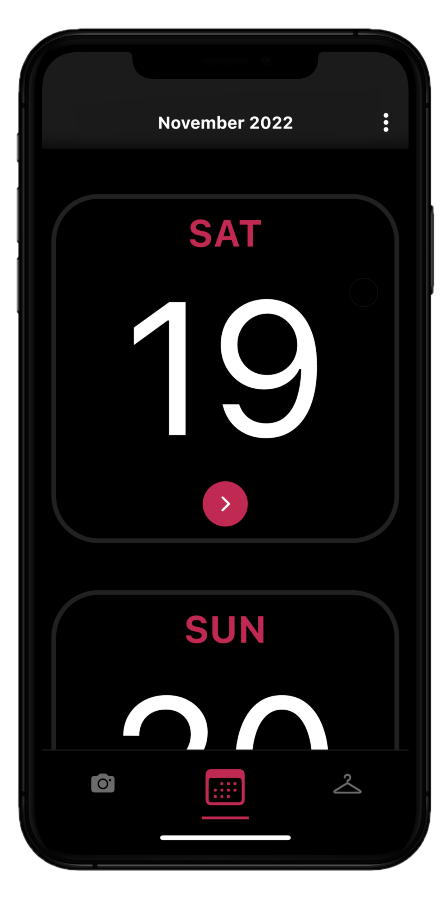
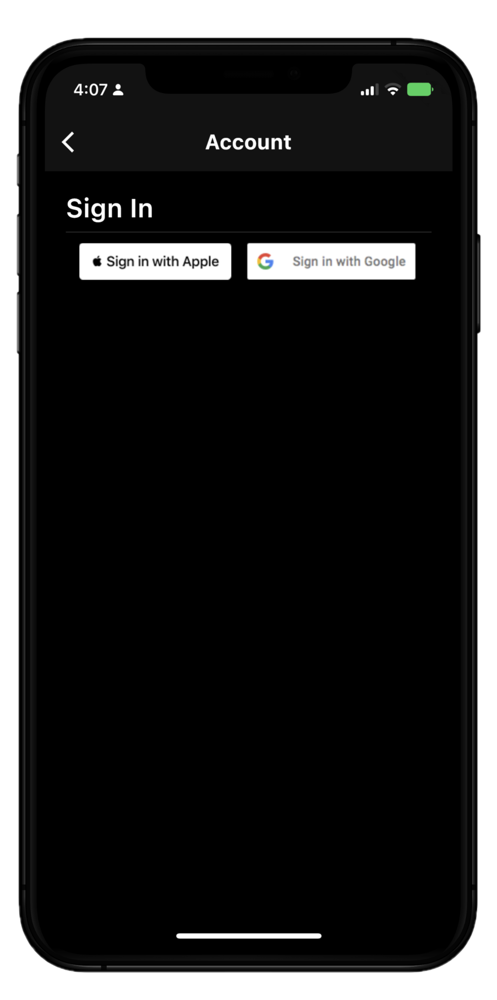
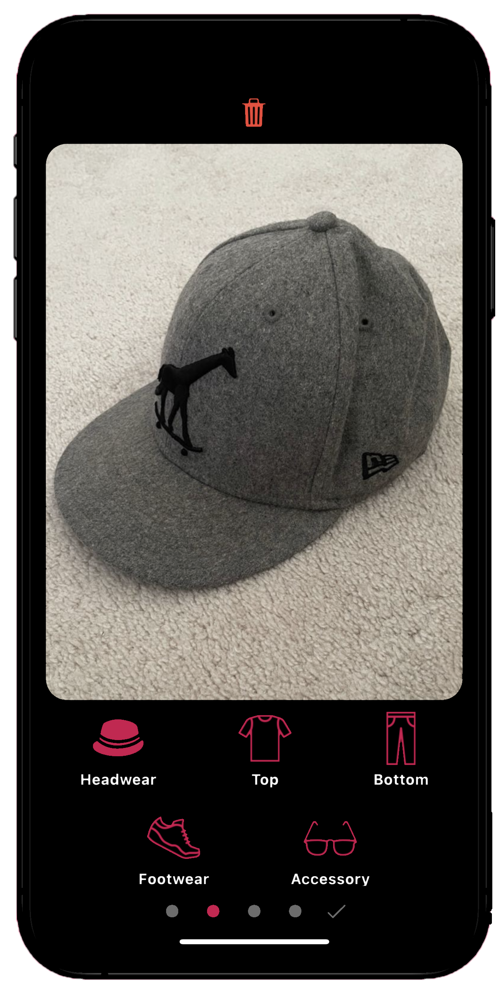
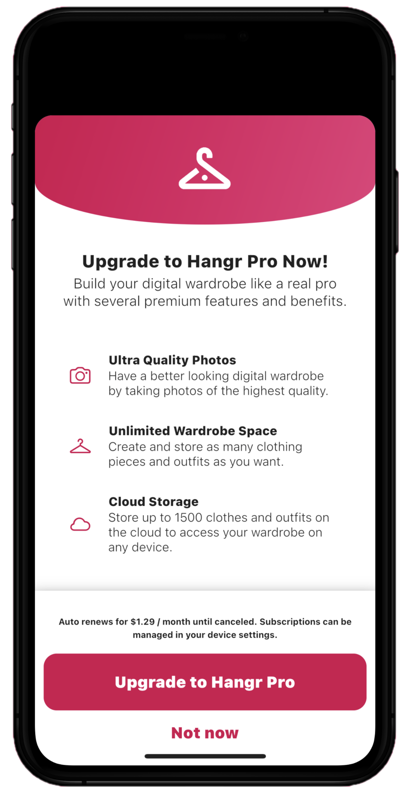
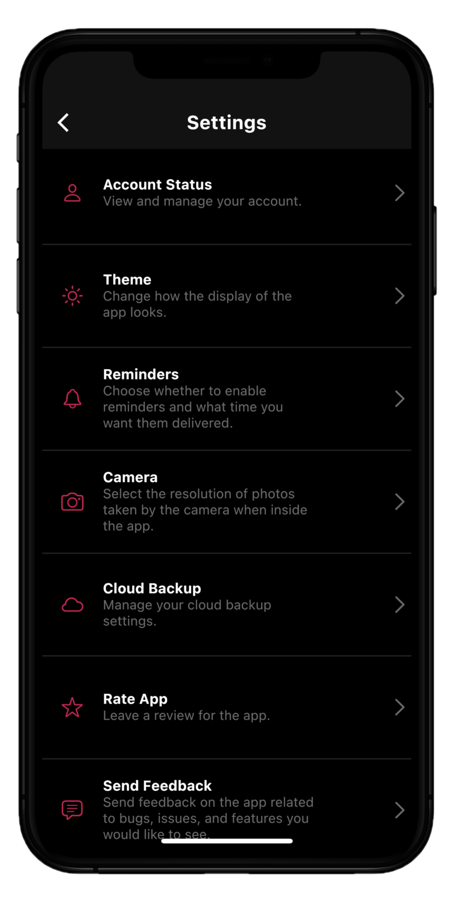

# Hangr
This is a mobile application for iOS and Android made using Flutter and Firebase. You can easily catalog and organize your entire wardrobe digitally. Simply snap photos of your clothing items or import them from your local photo album. Seamlessly categorize your clothes by type, color, and occasion making it a breeze to find the perfect piece for any occasion. The app features an integrated calendar that allows you to plan your outfits in advance, and grants you the option to set daily reminders to plan your outfit for the next day. Using Firebase's backend, users can opt to store their entire collection on the cloud and access it from any device as long as you are logged in. Using Flutter's in_app_purchase dependancy, users can subscribe and unlock more features such as the option to back-up data on the cloud, create and store more photos, and store photos at a higher quality.

# Instructions/Notes

You can install a beta version of this application for iOS through [TestFlight](https://testflight.apple.com/join/IZZbNveU)

# Contributers
Junior Green<<juniorgreen9185@hotmail.com>>

# Gallery
**Home Calendar**

**Login Screen**

**Add Clothing Screen**

**Subscription Modal**

**Settings Screen**

